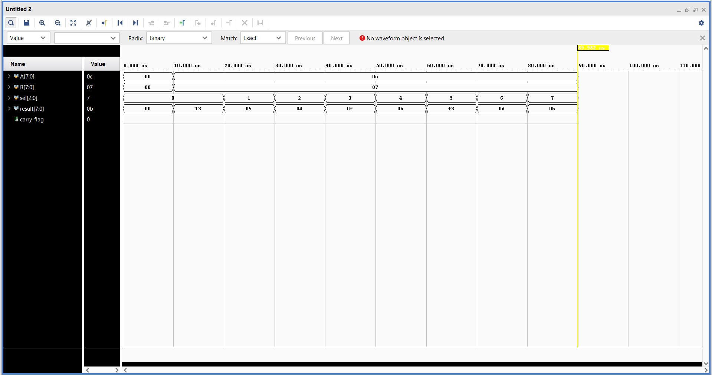

# 8-Bit Arithmetic Logic Unit (ALU) Design

A fully combinational 8-Bit Arithmetic Logic Unit (ALU)** designed using Verilog HDL and verified via Behavioral Simulation on Xilinx Vivado**.

# 📌 Project Overview
The objective of this project is to implement a basic 8-bit ALU capable of performing arithmetic and bitwise logical operations based on a 3-bit selection line (`sel`). 

# Key Features:
* No Inferred Latches: Designed with complete case coverage (including default states) to ensure a purely combinational circuit, optimizing timing and FPGA resource utilization.
* Power-On Reset Simulation:** The testbench handles initialization smoothly to prevent any unexpected `X` (Unknown) states during the initial simulation phase.

---

# 🛠️ Specifications & Operation Table

The ALU processes two 8-bit inputs (`A`, `B`) and generates an 8-bit `result` along with a 1-bit `carry_flag`.

| Selection Line (`sel`) | Operation | Description |
|-----------------------|-----------|-------------|
| `3'b000` | Addition | `result = A + B` (with Carry Out) |
| `3'b001` | Subtraction | `result = A - B` |
| `3'b010` | Bitwise AND | `result = A & B` |
| `3'b011` | Bitwise OR | `result = A \| B` |
| `3'b100` | Bitwise XOR | `result = A ^ B` |
| `3'b101` | Bitwise NOT | `result = ~A` |
| `3'b110` | Increment | `result = A + 1` |
| `3'b111` | Decrement | `result = A - 1` |

---

# 💻 Tools Used
* Hardware Description Language: Verilog HDL
* Simulation & Synthesis Tool: Xilinx Vivado

---

# 📊 Simulation Results & Waveform

The design was verified using a comprehensive testbench applying stimulus across all selection lines sequentially with a 10ns delay.

# Waveform Analysis:
* 0ns - 10ns: Power-on initialization period where inputs are held at stable `00` values, ensuring zero glitching or red-lined unknown states.
* 10ns onwards: Operations execute smoothly. For inputs `A = 12 (0c hex)` and `B = 7 (07 hex)`:
  * Addition (`sel=0`) yields `13 hex (19 decimal)`.
  * Subtraction (`sel=1`) yields `05 hex`.
  * Logical AND (`sel=2`) yields `04 hex`.

# Simulation Waveform:

